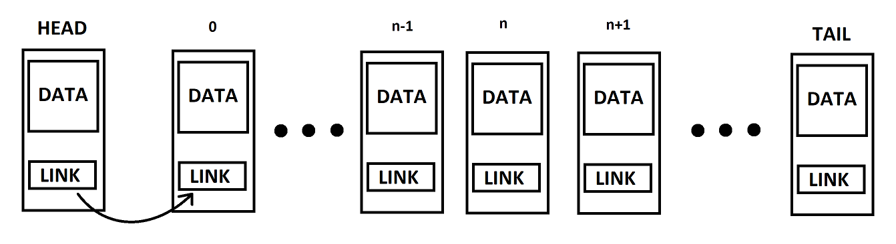

# XLList
Double linked list with only one pointer in node.

Head is special node. It doesn't contain data. It is helper node
for moving through the list. It's link is direct pointer to the first node.

  

Tail is last node in list. It's index is size-1. This is a valid node.

Each LINK is calculated as:
LINK_n = xor(*NODE_n-1, *NODE_n+1)
LINK_0 = xor(*HEAD, *NODE_1)
LINK_size-1 = xor(*NODE_size-2, *HEAD).

**NOTICE**: LINK is of type *NODE.

  

To move from NODE_n to NODE_n+1 two pointers are used. Pointer to
NDOE_n-1 and pointer to NODE_n. Then *NODE_n+1 is calculated as:
*NODE_n+1 = xor(*NODE_n-1, LINK_n)

  

Following rules apply in xor operations:
 - xor(A,A) = NULL
 - xor(A, NULL) = A
 - xor(A, B) = xor(B, A)
 - xor(xor(A, B), C) = xor(A, xor(B, C))
 - If C = xor(A, B) then: 	xor(C, A) = xor(xor(A, B), A) = xor(xor(B,A), A) 
xor(C, A) = xor(B, xor(A, A)) = xor(B, NULL) = B 	
same for xor(C, B) = A.
